# Modélisation des Systèmes de Vision - PROJET

### Réalisé par :

- Mohamed Karam BEHAZ

### Encadré par :

- Camille KURTZ

### Projet :

- **Projet Name:** Segmentation des Tumeurs cérébrales
- **Sujet:** Partie "Fusion Précoce"
- **Date:** 23 Janvier 2024

## Introduction :

L'objectif de ce projet est la segmentation 3D des tumeurs cérébrales à partir d'images IRM 3D représenté en quatre modalités `T1, T1ce, T2, Flair`.

Nous allons concevoir un modèle U-Net tridimensionnel et qui a en entrée les quatre modalités pour produire une segmentation des trois régions tumorales : la tumeur active (ET), la tumeur entière (WT) et le noyau tumoral (TC).

Voici une vue globale du résultat attendu :

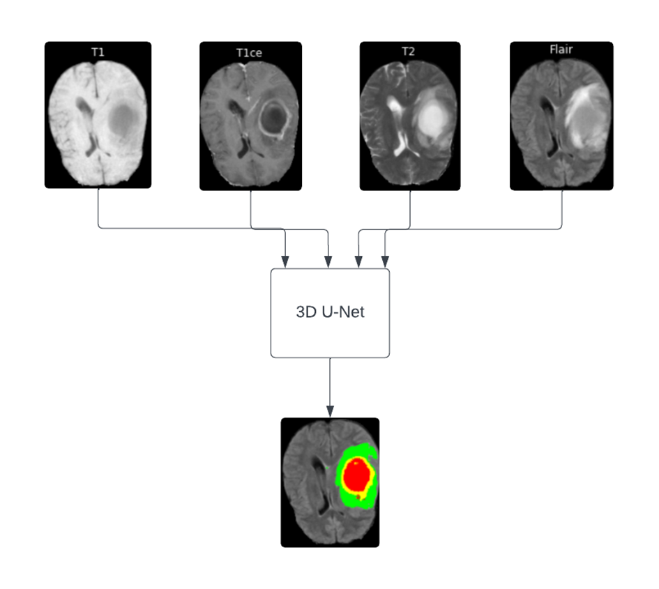

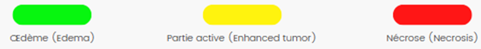

## Dataset et environnement :

BraTS (Brain Tumor Segmentation) met en disposition un ensemble de données IRM 3D déjà prétraité avec une dimension volumique de (240 x 240 x155). Chaque donnée IRM est constituée des quatre modalités d'acquisition de l'IRM `(T1, T1Ce, T2, FLAIR)` accompagnées de la vérité terrain `(GT)`.

Chaque IRM est segmentée en 4 classes : arrière-plan (tissu sain), œdème, nécrose et tumeur active. Tous les scans IRM multimodaux de BraTS sont disponibles sous forme de fichiers NIfTI `(.nii.gz)`.

Voici un tableau qui montre les dernières versions du dataset BraTS, nous allons utiliser celui de 2021 qui est le plus récent disponible :

| **Year** | **Total data** | **Training data** | **Validation data** | **Testing data** | **Tasks** |
| --- | --- | --- | --- | --- | --- |
| **2012** | 50 | 35 | / | 15 | Segmentation |
| **2013** | 60 | 35 | / | 25 | Segmentation |
| **2014** | 238 | 200 | / | 38 | Segmentation |
| **2015** | 253 | 200 | / | 53 | SegmentationDisease progression |
| **2016** | 391 | 200 | / | 191 | SegmentationSurvival prediction |
| **2017** | 477 | 285 | 46 | 146 | SegmentationSurvival prediction |
| **2018** | 542 | 285 | 66 | 191 | SegmentationSurvival prediction |
| **2019** | 626 | 335 | 125 | 166 | SegmentationSurvival prediction |
| **2020** | 660 | 369 | 125 | 166 | SegmentationSurvival prediction |
| **2021** | 2000 | 1251 | 211 | 538 | SegmentationMGMT classification |

Toutes les exécutions d'entrainement de notre modèle ont été effectué à l'aide de « Kaggle ». C'est une plateforme en ligne qui permet d'écrire des programmes en langage Python et offre des outils pour le calcul à haute performance avec un accès gratuit aux GPUs.

Nous avons utilisé le **Nvidia P100 avec 30 Go** de disque en exécution hors ligne s'appuie sur la technologie Turing révolutionnaire à coeurs Tensor pour offrir des performances de calcul multi-précision avec une grande variété de charges de travail.

## Architecture :

Nous avons proposé un **U-Net** 3D avec 4 channels.

Le chemin de l'encodeur contient quatre blocs de convolution et commence par un nombre de filtre égal à 8. Chaque bloc comporte deux unités de convolution dont chacune comprend une couche de convolution, une couche de normalisation par lots (BN) et une fonction d'activation, appelée Rectified Unité linéaire (ReLU), la même fonction utilisée dans l'architecture U-net originale. Pour le sous-échantillonnage, une couche de convolution est appliquée, au lieu d'une couche Maxpooling, pour augmenter la précision, avec `Stride = 2`, `Padding = 2` et un `filtre de taille 4 x 4 x 4`. À chaque étape de sous-échantillonnage, le nombre de canaux de fonctionnalités est doublé. De la même manière, le chemin du décodeur est construit à l'aide de quatre blocs convolutifs.

Avant chaque bloc, il y a une opération de suréchantillonnage qui augmente la taille de la carte de caractéristiques de 2, suivie d'une convolution `4 x 4 x 4` et d'une concaténation avec les cartes de caractéristiques correspondant au chemin de l'encodeur. Au niveau de la dernière couche du chemin du décodeur, une convolution `1 x 1 x 1` avec la fonction d'activation Softmax est utilisée pour mapper les cartes de caractéristiques multicanaux au nombre souhaité de classes, c'est-à-dire que le modèle fournit une entrée, via le Fonction Softmax, une prédiction plausible des tissus sains et du fond (classe 0) et des structures intra-tumorales : nécrose et tumeur non rehaussée (classe 1), œdème (classe 2) et tumeur rehaussée (classe 4).

Entre les chemins d'encodage et de décodage, nous avons inséré un bloc "Bottleneck" qui fait office de pont pour relier les deux chemins. Ce bloc est constitué de quatre couches de convolution simples avec un filtre de taille `4 × 4 × 4` et une concaténation, à chaque instant, avec le résultat de la couche de convolution précédente. Afin d'éviter le surapprentissage, nous avons ajouté une couche de dropout avec un taux = 0,1 à la fin de chaque bloc de convolution des deux chemins.

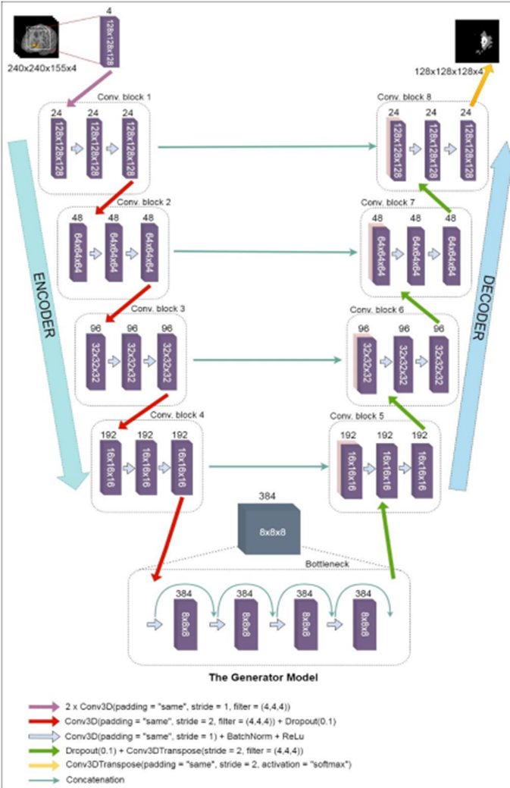

## Démarche suivie et résultats :

**Critères d'évaluation :**

L'évaluation quantitative des modèles de segmentation entrainés a été effectuée en calculant les quatre indicateurs ou métriques à savoir le coefficient Dice, la sensibilité, la spécificité et la distance de Hausdorff; pour trois zones tumorales différentes avec la structure suivante :

* **WT = ET ∪ ED ∪ NCR/NET**
* **TC = ET ∪ NCR/NET**
* **ET = ET**

1.   ED (edema -> classe 2)
2.   ET (enhancing_tumor -> classe 3)
3.   NCR/NET (non_enhancing_tumor -> classe 1)
4.   BG (background -> classe 0)

:=\max\left\(\sup&space;_{x\in&space;X}d(x,Y),\sup&space;_{y\in&space;Y}d(X,y)\,\right\),})

En plus de l'évaluation quantitative, le modèle conçu subie une évaluation qualitative, elle consiste à une comparaison visuelle d'une coupe 2D entre les labels des vérités de terrain et les labels prédites par le modèle. Il vaut mieux que ce type d'évaluation soit réalisée par un expert pour assurer la fiabilité.

La fonction loss utilisé est la DiceLoss :

}{(\sum_i^n&space;p_i^2&plus;\sum_i^n&space;g_i^2)})

Où les sommes portent sur les _n_ voxels du volume de segmentation prédit et du volume de vérité terrain .

Avant de passer les images au modèle on effectue une normalisation des images, puis on extrait des patch aléatoire (un par image) de taille `128 x 128 x 128`.

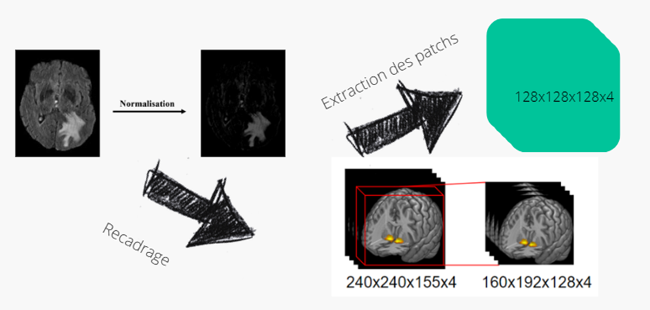

Ceci va nous permettre d'avoir un ensemble de données représenté sous forme d'hyper volumes de `128 x 128 x 128 x 4` ou channel = 4 représentants les 4 modalités de l'IRM. Et on les organise en batch avec batchsize = 4.

Nous avons utilisé les techniques d'augmentation de donnée `(Flip, Elastic, Brightness, Rotation)`.

Le taux d'apprentissage est de 0.001 en premier puis on le diminue selon une expo jusqu'à atteindre 0.0002 au cours des époques.

Le dropout utilisé est de 0.1 et l'entrainement a duré 26 heures

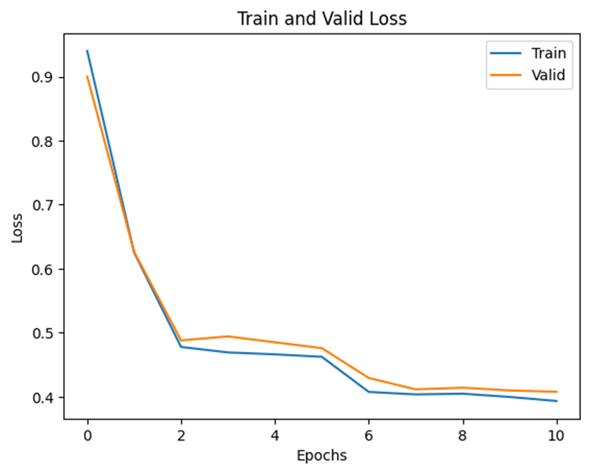

_Train et validation Loss_

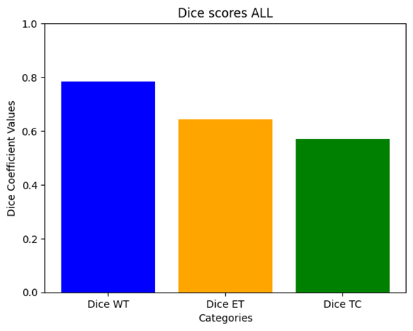

_Dice score_

Voici un résumé des résultats obtenus avec les métriques d'évaluation définis :

| | ET | TC | WT |
| --- | --- | --- | --- |
| Dice Score | 0.64 | 0.57 | 0.78 |
| Sensitivity | 0.60 | 0.47 | 0.76 |
| Specificity | 1 | 1 | 1 |
| Hausdorff-d | 4.60 | 10.44 | 13.77 |

_Scores obtenus_

Voici quelques exemples de segmentations obtenus :

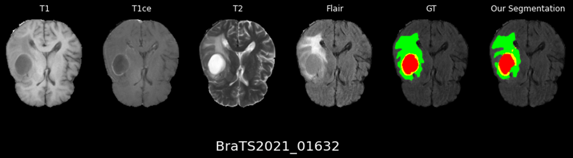

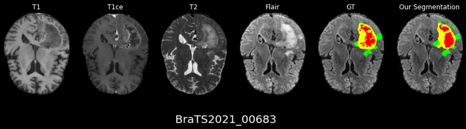

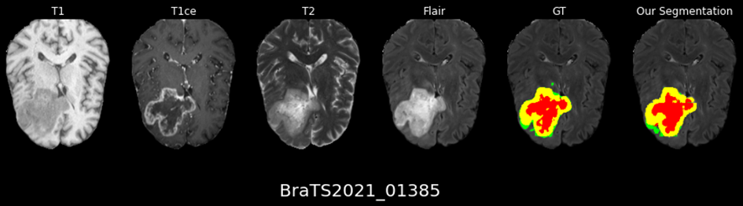

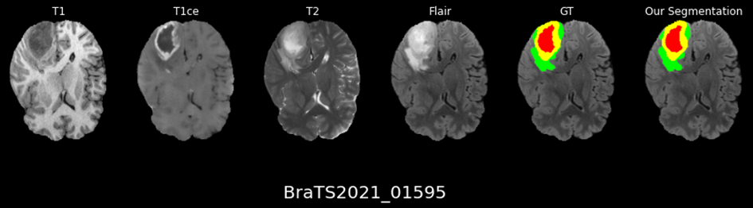

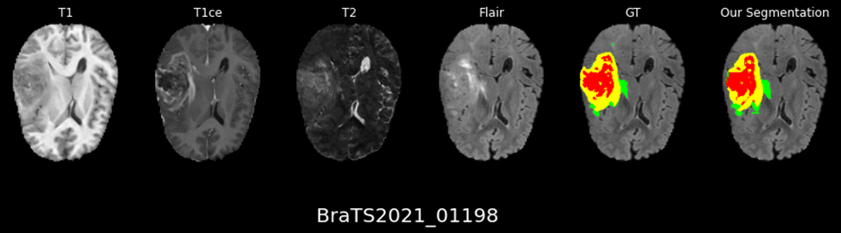
